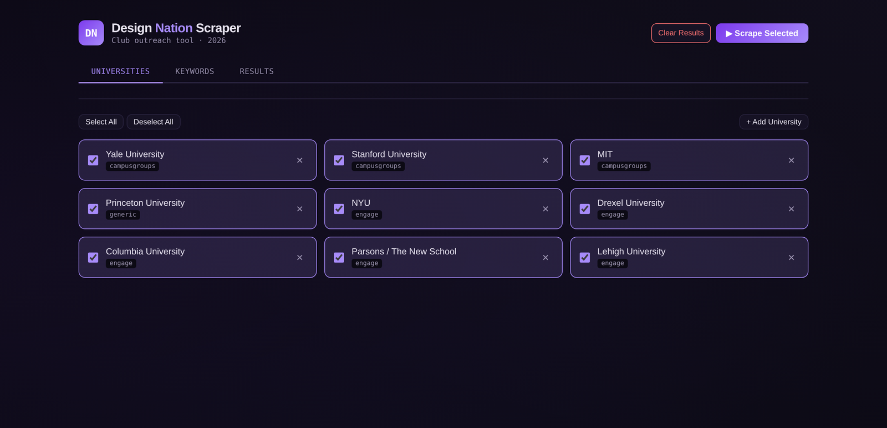
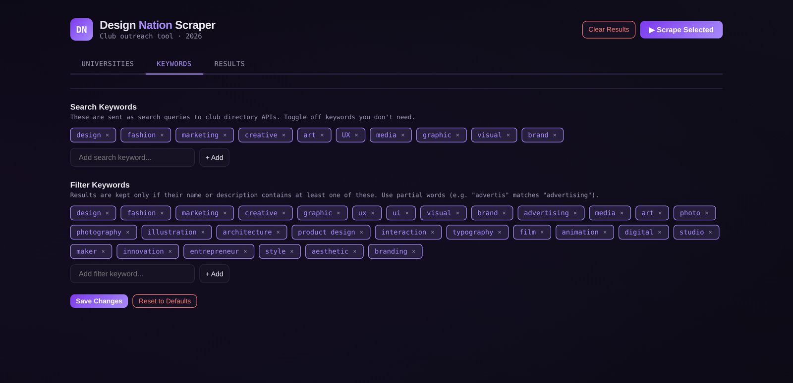

# Club Scraper

A local web app that finds design-related student organizations across university club
directories and collects their contact info into one searchable, sortable table.

Built for the **[Design Nation 2026](https://dn.businesstoday.org)** outreach team at
Business Today — an all-expenses-paid design conference for undergraduates. Reaching
students at dozens of schools means finding hundreds of clubs first, and every university
publishes its directory on a different platform. This tool does that collection step.



---

## What it does

- **Auto-detects the directory platform.** You paste a university name and a club
  directory URL — the app figures out whether it's CampusGroups, CampusLabs Engage, or a
  plain HTML page, and picks the right scraping strategy. No dropdown, no guessing.
- **Three scraping backends.** CampusGroups JSON API (with an HTML fallback for schools
  that disable the API), Engage discovery API, and a generic HTML scraper that parses
  tables and heading/link patterns.
- **Gets past Cloudflare.** Falls back to `cloudscraper` when a plain request returns 403.
- **Keyword control from the UI.** *Search* keywords are sent to the directory APIs as
  queries; *filter* keywords are applied locally with whole-word matching to drop the
  false positives.
- **Relevance scoring.** Name match = 2 points, description match = 1 point per keyword.
  Results are grouped by school and sorted by relevance within each group.
- **Live progress.** Scraping runs on a background thread with a polled progress log, so
  the UI stays responsive across a dozen schools.
- **Contact extraction.** Email, Instagram, and website per club, plus a per-club outreach
  status field.



---

## Quickstart

```bash
pip install -r requirements.txt
python app.py
```

Then open <http://localhost:8080> — the app opens your browser automatically.

Requires Python 3.10+. Dependencies: `flask`, `requests`, `beautifulsoup4`, `openpyxl`,
`cloudscraper`.

### Or just download it

Prebuilt, no Python needed — grab the executable from the
**[latest release](https://github.com/IAmNotStep/club-scraper/releases/latest)**, then
double-click it. It starts the server and opens your browser on port 8080.

Building your own copy: see **[BUILD.md](BUILD.md)** for packaging a standalone Windows
`.exe` or Mac binary with PyInstaller.

---

## How it works

**Single-file Flask app.** `app.py` holds the backend and the entire frontend (embedded
HTML/CSS/JS rendered via `render_template_string`). No build step, no `node_modules`, no
database — one file you can read top to bottom.

### Platform detection cascade

Detection runs cheapest-first and stops at the first confident answer:

| Level | Check | Cost |
|---|---|---|
| 1 | Local cache lookup in `platform_cache.json` | free, instant |
| 2 | URL pattern hints (`campusgroups`, `campuslabs`, `engage`, `callink`, `yaleconnect`, …) | free, no HTTP |
| 3 | HTML fingerprinting — regex for platform-specific scripts, JS globals, meta tags | 1 request |
| 4 | API probing — try the CampusGroups endpoint, then the Engage endpoint | 1–2 requests |
| 5 | Fall back to the generic HTML scraper | — |

Every resolved URL is written back to the cache, so a school is only ever detected once.

### Scraping backends

| Platform | Endpoint | Fallback |
|---|---|---|
| CampusGroups | `/api/v1/groups` | HTML parse of `/club_signup` |
| Engage / CampusLabs | `/api/discovery/search/organizations` | — |
| Generic | HTML via `requests` → `cloudscraper` | table and heading/link parsing |

URLs are normalized before API calls — trailing path suffixes like `/organizations` and
`/club_signup` are stripped so the API base is built correctly.

---

## Project structure

```
app.py                 Flask backend + embedded frontend (single file)
requirements.txt       Python dependencies
platform_cache.json    Persisted URL → platform detection cache
BUILD.md               Packaging instructions (Windows / Mac)
CLAUDE.md              Architecture notes for AI coding assistants
docs/                  Screenshots
```

---

## Known gaps

Honest list of what this doesn't do yet:

- **No persistence.** Results live in memory and reset when the server restarts.
- **No export in this version.** An earlier prototype wrote CSV/Excel; it isn't wired into
  the current UI.
- **Directory URLs are manual.** You have to find and paste each school's club directory
  link — there's no auto-discovery from a school name.
- **Generic scraper is best-effort.** Schools with unusual HTML may return partial results.

Ideas on the list: SQLite persistence, bulk import of schools, email templating, and an
outreach dashboard with response-rate stats.

---

## Adapting this for another club

The tool isn't specific to design — it's specific to whatever keywords you give it. To
retarget it (a consulting club looking for business orgs, say):

1. Fork this repo.
2. Edit `SEARCH_KEYWORDS` and `FILTER_KEYWORDS` near the top of `app.py` — or just change
   them live in the **Keywords** tab and hit Save.
3. Edit `DEFAULT_UNIVERSITIES` for the schools you care about, or add them from the
   **Universities** tab at runtime.
4. Change the header title/branding in the `HTML_TEMPLATE` string.

`CLAUDE.md` documents the architecture in the format Claude Code and similar assistants
read, so an AI-assisted fork has the context it needs from the first prompt.

Scrape responsibly: requests run sequentially, one school at a time, and you should check
each site's terms of service and `robots.txt` before pointing the tool at it.

---

## License

MIT — see [LICENSE](LICENSE).
